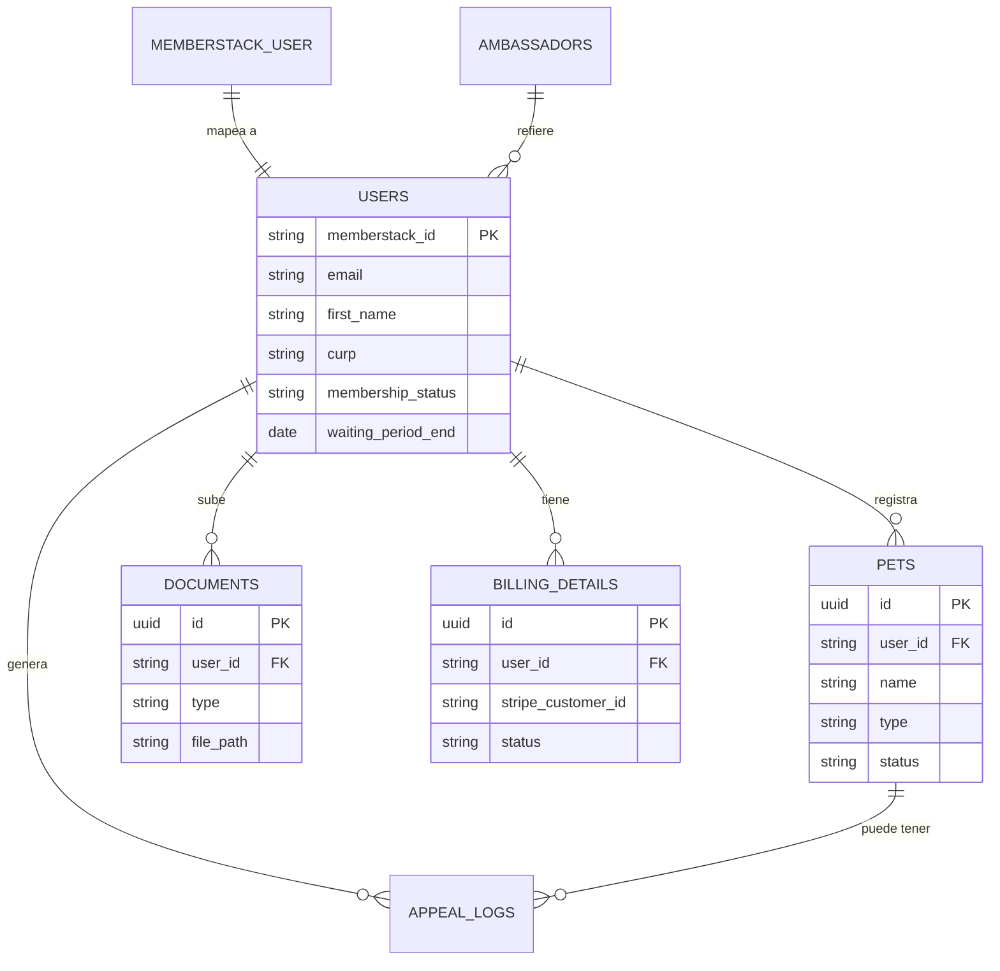

# Documentación Técnica - Sistema de Membresías Club Pata Amiga

Este documento detalla la arquitectura técnica, modelos de datos, integraciones y flujos del sistema de registro y administración de Club Pata Amiga.

## 1. Arquitectura General

El sistema está construido como una aplicación web moderna utilizando las siguientes tecnologías:

*   **Frontend**: Next.js 15.5+ (App Router), React 19, CSS Modules.
*   **Backend**: Next.js API Routes (Edge & Node.js runtime).
*   **Lenguaje**: TypeScript 5.3+ (Modo estricto).
*   **Autenticación**: Memberstack v2 (Gestión de usuarios y campos personalizados).
*   **Base de Datos**: Supabase (PostgreSQL).
*   **Almacenamiento de Archivos**: Supabase Storage.
*   **Diseño**: Sistema de diseño basado en variables CSS (Tokens) con tipografías Fraiche y Outfit.

---

## 2. Modelos de Datos y Relaciones

El sistema utiliza un enfoque híbrido entre **Memberstack** (para auth y metadatos rápidos) y **Supabase** (para integridad referencial y almacenamiento robusto).

### Entidades Principales

#### Miembros (Users)
*   **Memberstack ID**: Llave única de vinculación.
*   **Datos Personales**: Nombre, apellidos, género, fecha de nacimiento, CURP.
*   **Contacto**: Email (verificado), teléfono.
*   **Dirección**: Código postal, estado, municipio, colonia, calle/número.
*   **Estado de Membresía**: `pending`, `waiting_approval`, `approved`, `rejected`.
*   **Periodo de Carencia**: Calculado automáticamente (90 días para humanos).

#### Mascotas (Pets)
*   **Relación**: N mascotas pertenecen a 1 usuario (máximo 3 por registro inicial).
*   **Campos**: Nombre, tipo (perro/gato), raza, edad, peso, talla.
*   **Documentación**: Foto de la mascota, certificados veterinarios.
*   **Estado**: Aprobación individual por mascota.

#### Registros de Apelación (Appeal Logs)
*   **Propósito**: Historial de comunicación entre administradores y miembros en caso de rechazo o falta de información.
*   **Tipos**: Mensajes del sistema, mensajes de usuario, peticiones de información de admin.

### Diagrama de Relaciones (ERD)

---

## 3. APIs e Integraciones

### Integraciones de Terceros

| Servicio | Propósito |
| :--- | :--- |
| **Memberstack** | Autenticación, gestión de sesiones y campos personalizados del perfil. |
| **Supabase** | Base de Datos relacional, Storage para documentos sensibles (INE, Fotos). |
| **Stripe** | Procesamiento de pagos recurrentes y gestión de suscripciones. |
| **Resend** | Envío de correos transaccionales (Bienvenida, Aprobación, Avisos). |
| **Sanity** | CMS para gestionar contenido dinámico del sitio. |
| **LynSales** | CRM para gestión de leads y seguimiento comercial. |
| **Copomex** | API para autocompletado de direcciones mediante código postal. |

### Endpoints Principales (Next.js API)

*   `POST /api/crm/upsert`: Sincroniza datos de usuario con el CRM.
*   `POST /api/admin/members/[id]/approve`: Activa la membresía y notifica al usuario.
*   `POST /api/admin/members/[id]/reject`: Marca rechazo y registra el motivo.
*   `GET /api/admin/metrics`: Agregado de métricas para el dashboard (Miembros totales, recaudación, etc.).

---

## 4. Flujo de Datos del Registro

1.  **Paso 1: Autenticación**: El usuario crea cuenta en Memberstack (Email/Password o Google).
2.  **Paso 2: Datos Personales**: Se capturan datos y se suben documentos a Supabase Storage. Se crea el registro espejo en la tabla `public.users`.
3.  **Paso 3: Selección de Plan**: Integración con Stripe Checkout para el pago de la membresía.
4.  **Paso 4: Registro de Mascotas**: Captura de datos de hasta 3 mascotas y carga de sus fotos/certificados.
5.  **Paso 5: Sincronización Final**: Los datos se envían al CRM y se marca el perfil como `waiting_approval`.

---

## 5. Seguridad y Permisos

*   **Documentos Privados**: Las identificaciones (INE) se almacenan en buckets privados de Supabase con acceso restringido mediante RLS.
*   **Roles de Admin**: El sistema distingue entre `Admin` (revisión de miembros) y `Super Admin` (ajustes del sistema, gestión de otros admins, eliminación de registros).
*   **Validación de Sesión**: Las API routes de administración verifican el token de Memberstack y el rol en la base de datos antes de procesar cualquier acción.
