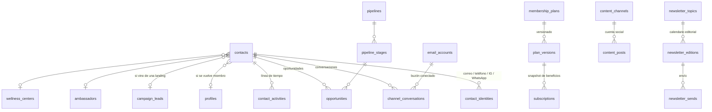

# Portal de ventas — Sección 0: Arquitectura y roadmap

> **Estado:** propuesta para aprobación. Nada de esto está construido todavía.
> **Punto de retorno:** etiqueta `v1.0-plataforma-base` (commit `cdf68e7`) — es la
> plataforma tal como funciona hoy, antes de esta etapa.
> **Documentos hermanos:** `01-CONTACTOS-CRM.md` … `07-TABLEROS.md` (uno por
> sección; se escriben y se aprueban de a uno).

---

## 1. Qué construimos

Un **portal de ventas** dentro de la misma aplicación, que reemplaza las
funciones que hoy el equipo haría en GoHighLevel: bandeja de conversaciones
multicanal, CRM con contactos y pipelines, calendario de contenido con
aprobación, newsletter asistido por IA, creación de membresías con beneficios,
y tableros con métricas.

No es un producto aparte. Es **una segunda puerta a la misma plataforma**, con
su propio menú y sus propios permisos.

### Qué ya existe y se reutiliza (no se reconstruye)

| Pieza que ya funciona | Dónde vive hoy | Qué le falta para el portal |
| --- | --- | --- |
| Bandeja de canales (Messenger, IG, WhatsApp) | `channel_conversations`, `channel_messages`, `/admin/conversaciones` | Correo entrante, notas internas, asignación, plantillas con adjuntos |
| Etapas de pipeline por conversación | `channel_conversations.pipeline_stage` | Pipelines configurables, oportunidades con valor y propietario |
| Escalación ❗ y aviso al equipo | Bandeja + `notifyTeam` | Reglas por rol y bandeja de "míos" |
| Plantillas de correo editables | `email_templates`, `/admin/comunicados` | Adjuntos, uso desde la bandeja, plantillas de mensaje (no solo correo) |
| Agentes IA con voz de marca, ánimo y límites | `src/lib/llm/` | Modo demo para no-miembros; handoff desde la nueva bandeja |
| Conocimiento editable de los agentes | `agent_promos` + instrucciones extra | Se extiende, no cambia |
| Fichas emergentes con permisos por rol | `components/admin/DetailModal.tsx` | Se comparte con el portal de ventas |
| Gráficas y envío de reporte por correo | `MiniBarChart.tsx`, `admin/ReportButton.tsx` | Se comparte con el tablero de ventas |
| Captura de suscriptores | `newsletter_subscribers` | Todo el proceso editorial |

---

## 2. Principio rector: fuente única, dos superficies

**Una sola base de datos, un solo juego de componentes, dos menús.**

`/admin` y `/ventas` renderizan **los mismos componentes** con distintos
permisos. Una mejora hecha para el portal de ventas aparece sola en el panel de
administración, y al revés. No hay "versión de admin" de una tabla ni copias de
un formulario.

En la práctica esto significa tres reglas de código:

1. **Nada de rutas duplicadas para la misma información.** La bandeja vive en
   `src/components/panel/conversaciones/`. `/admin/conversaciones` y
   `/ventas/conversaciones` son cascarones de 20 líneas que le pasan el rol.
2. **Los permisos son un dato, no un `if` disperso.** Un único archivo
   `src/lib/permissions.ts` responde `can(rol, capacidad)`. Los componentes
   reciben las capacidades como props y no consultan el rol por su cuenta.
3. **Las server actions validan del lado del servidor, siempre.** Ocultar un
   botón no es seguridad. Cada acción vuelve a preguntar por el rol y las
   políticas RLS de Supabase son la última línea.

---

## 3. Roles y permisos

### 3.1 Roles nuevos

Se agregan dos valores al enum `user_role` (hoy `member | admin | super_admin`):

| Rol | Quién es | Aterriza en |
| --- | --- | --- |
| `ventas` | Ejecutivo de ventas / atención a clientes | `/ventas` |
| `gerente_ventas` | Gerente: aprueba contenido y newsletter, ve tableros | `/ventas` |

> **Nota técnica para la migración:** en PostgreSQL, un valor agregado con
> `alter type ... add value` no puede usarse en la misma transacción que lo
> creó. Van en **dos migraciones separadas**: una que agrega los valores y otra
> que los usa en políticas y datos semilla.

### 3.2 Matriz de permisos

Leyenda: ● completo · ◐ limitado / solo lo asignado · ○ sin acceso

| Capacidad | `ventas` | `gerente_ventas` | `admin` | `super_admin` |
| --- | :-: | :-: | :-: | :-: |
| Bandeja de conversaciones | ◐ asignadas + sin asignar | ● | ● | ● |
| Tomar / responder una conversación | ● | ● | ● | ● |
| Ver chats del asistente del portal y del bot vet | ◐ solo lectura | ◐ solo lectura | ◐ solo lectura | ● |
| Contactos: ver, crear, etiquetar | ● | ● | ● | ● |
| Contactos: fusionar duplicados / borrar | ○ | ● | ● | ● |
| Pipelines: mover tarjetas, crear oportunidades | ● | ● | ● | ● |
| Pipelines: crear/editar pipelines y etapas | ○ | ● | ● | ● |
| Calendario de contenido: redactar y programar | ● | ● | ● | ● |
| Calendario: **aprobar** para publicación | ○ | ● | ● | ● |
| Newsletter: proponer temas, revisar borrador | ● | ● | ● | ● |
| Newsletter: **aprobar y programar envío** | ○ | ● | ● | ● |
| Planes de membresía: ver | ● | ● | ● | ● |
| Planes: crear versión nueva / publicar en Stripe | ○ | ● | ○ | ● |
| Migrar miembros existentes a una versión nueva | ○ | ○ | ○ | ● |
| Tablero de ventas + enviar reporte | ◐ sus números | ● | ● | ● |
| **Datos personales sensibles del miembro** (INE, CURP, RFC, bancarios, expedientes de reintegro) | ○ | ○ | ◐ | ● |
| Panel de administración `/admin` | ○ | ○ | ● | ● |
| Interruptor del agente demo | ○ | ○ | ○ | ● |

**Regla dura de privacidad:** ningún rol de ventas ve documentos de identidad,
datos bancarios, CURP/RFC ni archivos de reintegro. Cuando abren la ficha de un
contacto que sí es miembro, ven estado de membresía, plan, antigüedad, mascotas
por nombre y su historial de conversación — nada más. Esto se aplica en las
políticas RLS, no solo en la interfaz.

---

## 4. El conmutador de portales

En el menú de perfil (esquina superior derecha del panel y del portal) aparece
**"Cambiar de portal"** cuando la cuenta tiene acceso a más de uno.

- `admin` y `super_admin` → Panel de administración · Portal de ventas
- `gerente_ventas` y `ventas` → solo Portal de ventas (el conmutador no aparece)
- Un miembro que además es embajador o centro aliado sigue con sus enlaces
  actuales; no cambia nada para él.

Para que no haya dudas de dónde está uno parado, la barra lateral lleva una
etiqueta de portal bajo el logo (`Administración` / `Ventas`) y el portal de
ventas usa el acento **naranja** de la marca en la barra activa, mientras que
administración conserva el **teal**. Misma tipografía, mismos tokens, misma
sensación.

`loginDestination()` (`src/lib/login-destination.ts`) agrega dos reglas antes de
las actuales: rol de ventas → `/ventas`. El resto de la cascada no se toca.

---

## 5. Rutas y estructura de archivos

```
src/app/ventas/
  layout.tsx              cascarón: sidebar, campana, conmutador de portal
  page.tsx                tablero de ventas
  contactos/              lista, ficha, vistas guardadas
  pipelines/              tablero kanban de oportunidades
  conversaciones/         bandeja unificada
  calendario/             calendario de contenido
  newsletter/             temas, borradores, aprobación
  membresias/             planes y versiones
  cuenta/                 perfil del usuario de ventas

src/components/panel/     ← compartido por /admin y /ventas
  PanelShell.tsx          sidebar + top bar + conmutador
  PortalSwitcher.tsx
  DetailModal.tsx         (se mueve desde components/admin)
  FilterChips.tsx         (se mueve)
  MiniBarChart.tsx        (se mueve)
  Bell.tsx                (se mueve desde AdminBell)
  ProfileMenu.tsx         (perfil + conmutador de portales)
  VentasNav.tsx
  contactos/  pipelines/  conversaciones/  calendario/  newsletter/  membresias/

src/lib/
  permissions.ts          capacidades por rol (fuente única)
  crm/                    contactos, deduplicación, actividad
  channels/               conectores (meta.ts ya existe; email.ts nuevo)
  content/                conectores de publicación
```

**Mudanza incluida en la Fase 0:** los cuatro componentes compartidos salen de
`components/admin/` a `components/panel/` y se actualizan sus importaciones.
Son pocos archivos y evita que nazcan copias. `AdminNav` se queda donde está —
es específico del panel; el portal de ventas tiene su propio `VentasNav`, ambos
alimentados por el mismo `PanelShell`.

> `ReportButton` (y la acción `sendReport`) **se quedan en `app/admin/` hasta la
> Fase 7**: mudarlos obliga a generalizar la acción para los roles de ventas, y
> eso pertenece al momento en que el tablero de ventas los necesite. Mover el
> componente sin su acción sería un refactor a medias.

---

## 6. Modelo de datos — vista de conjunto



Tablas nuevas por sección (el detalle va en cada documento):

- **S1 CRM:** `contacts`, `contact_identities`, `contact_activities`,
  `contact_tags`, `custom_field_defs`, `saved_views`, `pipelines`,
  `pipeline_stages`, `opportunities`
- **S2 Conversaciones:** `email_accounts`, `conversation_notes`,
  `message_templates` (extensión de `email_templates`), `template_assets`;
  columnas nuevas en `channel_conversations` (`contact_id`, `assigned_to`,
  `snoozed_until`, `last_activity_at`)
- **S3 Membresías:** `membership_plans`, `plan_versions`; columnas nuevas en
  `subscriptions` (`plan_version_id`, `benefits_snapshot`)
- **S4 Calendario:** `content_channels`, `content_posts`, `content_approvals`
- **S5 Newsletter:** `newsletter_topics`, `newsletter_editions`,
  `newsletter_runs`, `newsletter_sends`
- **S6 Agente demo:** ninguna — un ajuste en `site_settings`
- **S7 Tableros:** ninguna — consultas sobre lo anterior

---

## 7. Roadmap

Cada fase es un ciclo completo: **spec aprobada → migración → server actions →
interfaz → verificación en navegador (escritorio y 375 px) → commit → push**.
Nada avanza a la siguiente fase sin verificar la anterior con datos reales.

| Fase | Entrega | Depende de | Cómo sabemos que quedó |
| --- | --- | --- | --- |
| **F0 · Cimientos** | Roles nuevos, `permissions.ts`, `PanelShell` compartido, `/ventas` con tablero vacío, conmutador de portales, mudanza de componentes | — | Cuenta de prueba `ventas@pataamiga.dev` entra a `/ventas` y no puede abrir `/admin`; admin cambia de portal y vuelve |
| **F1 · Contactos y pipelines** | Tabla `contacts` + backfill de las 5 fuentes, ficha con línea de tiempo, etiquetas, campos personalizados, vistas guardadas, kanban de oportunidades | F0 | Un lead de landing, un miembro y un contacto de Instagram aparecen como un solo contacto cada uno, sin duplicados |
| **F2 · Conversaciones** | Bandeja unificada, correo entrante y saliente, notas internas, asignación, plantillas con adjuntos, handoff con la IA | F1 | Un correo entrante y un DM de Instagram del mismo contacto caen en su ficha; responder desde la bandeja llega al canal correcto |
| **F3 · Membresías** | Planes con beneficios versionados, alta en Stripe, snapshot en la suscripción, lectura del snapshot en períodos de espera y topes de reintegro | F0 | Un miembro dado de alta con la versión 1 conserva sus reglas después de publicar la versión 2 |
| **F4 · Calendario de contenido** | Borrador → revisión → **aprobado por gerente** → programado → publicado; autopublicación en Facebook e Instagram; aviso y publicación asistida en el resto | F0 | Un post sin aprobación no se publica aunque llegue su fecha; uno aprobado sí |
| **F5 · Newsletter** | Calendario editorial, agente investigador, agente de marca, aprobación del gerente, envío programado a suscriptores | F0, F4 (reusa la compuerta de aprobación) | Una edición completa recorre el circuito y llega a un correo de prueba |
| **F6 · Agente demo** | Interruptor de super admin, base reducida, CTA de alta, sin datos de miembro | — | Con el interruptor apagado el widget no aparece para no-miembros; encendido, responde sin tocar datos reales |
| **F7 · Tableros** | Tablero de ventas, tarjetas destacadas dentro de `/admin`, fichas emergentes por rol, envío de reporte | F1–F5 | Los números del tablero cuadran contra consultas directas a la base |

F3, F4 y F6 no dependen entre sí: si algún insumo del cliente se atora, se
saltan sin bloquear el resto.

---

## 8. Puntos de extensión (para que esto siga creciendo)

El pedido incluye "código limpio y abierto a recibir funciones nuevas". Se
concreta en cinco costuras explícitas, cada una con su registro en código:

1. **Canales** — `src/lib/channels/registry.ts`: un canal es un objeto con
   `id`, `recibir(payload)`, `enviar(mensaje)`, `puedeEnviarLibre(conv)`.
   Agregar SMS o Telegram mañana es un archivo nuevo y una línea en el registro;
   la bandeja no se entera.
2. **Conectores de publicación** — mismo patrón en `src/lib/content/registry.ts`
   (`publicar`, `limites`, `requiereAsistencia`). TikTok y LinkedIn entran así.
3. **Beneficios de plan** — catálogo declarativo en `src/lib/plans/benefits.ts`:
   cada beneficio declara su tipo, su valor por omisión y **quién lo consume**.
   El motor no sabe qué es un "período de espera": lee el catálogo.
4. **Capacidades** — agregar un permiso es una línea en `permissions.ts`;
   ningún componente conoce nombres de roles.
5. **Automatizaciones (diferido, pero preparado)** — decidimos no construir el
   motor de flujos de GoHighLevel en esta etapa. Para no cerrarnos la puerta,
   todos los cambios de estado relevantes (etapa movida, mensaje recibido,
   contacto creado, pago fallido) se emiten por una función única
   `emitirEvento(tipo, payload)` que hoy solo escribe en `contact_activities`.
   El día que se quiera automatizar, el motor se suscribe ahí y no hay que
   tocar ninguna pantalla.

---

## 9. No-objetivos de esta etapa

Se dejan fuera a propósito, para que el alcance sea real:

- **Motor visual de automatizaciones** (decisión tomada) — ver punto 8.5.
- **SMS y llamadas.** Ningún proveedor de telefonía en esta etapa.
- **Comentarios de publicaciones sociales.** Los DMs sí entran; los comentarios
  en posts no (es también una limitación conocida de GoHighLevel).
- **Blog público / archivo del newsletter en el sitio.** El newsletter se envía
  por correo; publicarlo como página pública sería una superficie nueva del
  sitio y se decidirá aparte.
- **Escucha social, atribución publicitaria y análisis de competencia.**
- **Multi-cuenta / multi-marca.** Una sola marca, una sola cuenta.

---

## 10. Insumos y cuentas que necesita el cliente

Igual que con los agentes IA, todo conector se entrega con marcadores
`CONECTAR:` y variables de entorno; el programador del cliente enchufa las
cuentas del cliente.

| Fase | Insumo | Bloquea |
| --- | --- | --- |
| F1 | Exportar de LynSales el CSV de contactos y el de oportunidades | Traer el histórico de los 989 clientes potenciales (sin esto se arranca solo con lo que ya vive en la plataforma) |
| F2 | Decisión de subdominio de correo (p. ej. `hola@pataamiga.mx`) y alta del proveedor de correo entrante | Correo entrante |
| F2 | Autorización OAuth de los buzones Gmail/Outlook del equipo | Sincronización de dos vías |
| F3 | Confirmación de que los planes y precios actuales son los definitivos | Publicar en Stripe |
| F4 | Permisos extra en la app de Meta (`pages_manage_posts`, `instagram_content_publish`) y revisión de la app | Autopublicación |
| F4 | Cuentas de TikTok/LinkedIn si se quieren en el calendario | Publicación asistida |
| F5 | Llave de Anthropic ya prevista (`ANTHROPIC_API_KEY`) y plantilla de marca del newsletter | Agente de marca |

Ninguno de estos insumos bloquea el arranque: sin ellos todo funciona en modo
demostración y la interfaz avisa qué falta, igual que hoy hace la bandeja
cuando no hay tokens de Meta.

---

## 11. Riesgos y cómo los contenemos

| Riesgo | Contención |
| --- | --- |
| Un cambio de ventas altera reglas de miembros vigentes | Planes versionados con snapshot en la suscripción; migrar cohortes solo lo puede hacer un super admin y queda registrado |
| Un post se publica sin revisar | La compuerta de aprobación es una restricción de base de datos, no un botón: sin `approved_by` el publicador no lo toma |
| El equipo de ventas ve datos que no debe | RLS por rol + la ficha de contacto nunca consulta las tablas sensibles |
| El agente demo promete algo que no existe | Base de conocimiento reducida, prohibición explícita de orientación veterinaria y de datos reales, apagado por omisión |
| La base de datos no tiene punto de retorno | Antes de la primera migración de F0 se guarda un volcado completo del proyecto Supabase de desarrollo |
| El alcance crece sin control | Una spec por sección, aprobada antes de escribir código; lo que no está en la spec entra al siguiente ciclo |

---

## 12. Terminología

Aplica sin excepción lo ya vinculante: **reintegro** y **período de espera**;
prohibido seguro, póliza, cobertura, carencia, fondo solidario, respaldo o
apoyo económico, y consulta o diagnóstico por chat. El bot es **orientación
veterinaria 24/7**. Esto vale también para los textos que redacte cualquier
agente IA del portal de ventas: la voz de marca compartida
(`src/lib/llm/brand-voice.ts`) sigue siendo la única fuente y no se puede
editar desde el panel.
